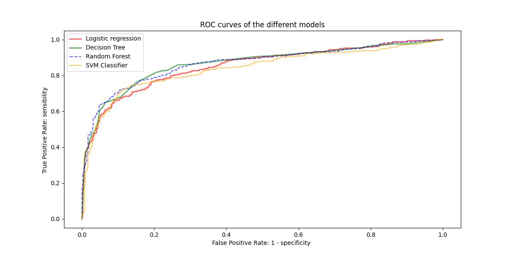
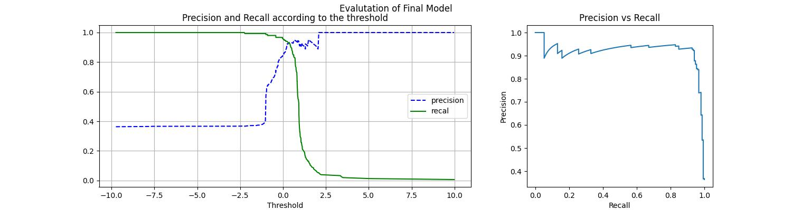

# 🚢 Titanic - Classification de survie

## 🎯 Objectif
Ce projet vise à prédire la probabilité de survie des passagers du Titanic en utilisant le jeu de données de la célèbre compétition Kaggle ["Titanic: Machine Learning from Disaster"](https://www.kaggle.com/c/titanic).  
L’objectif est de mettre en œuvre un pipeline de machine learning complet, depuis l’exploration des données jusqu’à l’optimisation d’un modèle prédictif.

---

## Data
Le dataset contient les informations des passagers du Titanic, avec notamment :
- **Pclass** : classe du billet (1, 2, 3)
- **Sex** : sexe
- **Age** : âge
- **SibSp** : nombre de frères/sœurs ou conjoints à bord
- **Parch** : nombre de parents/enfants à bord
- **Fare** : prix du billet
- **Embarked** : port d’embarquement (C, Q, S)
- **Survived** : variable cible (0 = non survécu, 1 = survécu)

---

## Étapes du projet

### 1. Analyse exploratoire (EDA)
- Inspection des données et gestion des valeurs manquantes.  
- Mise en évidence de corrélations fortes (via des graphiques, calcule de correlation, test statistiques) :
  - Les femmes survivent beaucoup plus souvent que les hommes.  
  - La classe (Pclass) est un facteur déterminant.  
  - Les enfants et les passagers avec des billets plus chers (Fare) ont de meilleures chances.  

### 2. Préprocessing & Pipeline
- **Imputation** des valeurs manquantes pour toutes les variables (médiane pour 'Age', mode pour 'Embarked').  
- **Encodage** des variables catégorielles ('Sex', 'Embarked').  
- **Mise à l’échelle** des variables numériques ('Age', 'Fare').  
- **Transformation log1p** appliquée sur `Fare` pour réduire l’asymétrie.  
- Construction d’un pipeline sklearn reproductible.  

### 3. Modélisation
Plusieurs modèles de classification testés avec la cross_validation à partir du train set:
- Régression Logistique  
- Arbre de Décision  
- Random Forest  
- SVM  

Les performances ont été évaluées via **Accuracy, Précision, Rappel et AUC**.
| model               |   accuracy |   precision |   recall |   auc |
|:--------------------|-----------:|------------:|---------:|------:|
| Logistic Regression |      0.8   |       0.765 |    0.693 | 0.853 |
| Decision Tree       |      0.826 |       0.865 |    0.649 | 0.866 |
| Random Forest       |      0.826 |       0.87  |    0.643 | 0.867 |
| SVM                 |      0.823 |       0.803 |    0.713 | 0.838 |

- Random Forest et SVM ressortent comme modèles compétitifs. Le premier obtient la meilleure accuracy (métrique kaggle) et le second la meilleure précision (métrique critique). 

### 4. Optimisation des hyperparamètres
- Hyperparamètres ajustés via 'RandomizedSearchCV'.  
- Avec une simple optimisation, le random_forest obtient un recall de 72%. Ce qui est bien mieux que le résultats précedant. 
- Quant au SVM, les étapes de fine tuning nous ont permis d'obtenir un recall de 76% en cross_validation. Et comme c'est la métrique que l'on cherche optimiser. C'est ce modèle qu'on retiendra pour l'évaluation finale. 

### 5. Évaluation finale
- Accuracy : **~82%**   
- Rappel : **~95%**  
- Courbes ROC et Precision-Recall analysées pour interpréter les compromis.  
- Décision métier : privilégier le **rappel** afin de maximiser l’identification des survivants.  

NB: Le datasets étant de petite taille il y a une variabilité des résultats du modèle, ce qui peut expliquer les meilleurs résultats sur le test set plutôt que le train set. De plus, j'utilise les datasets de train et test préparés par kaggle et il se peut qu'il y ait une certaine variablité. 
---

## ✅ Résultats
- Le modèle final atteint **91% d’accuracy** sur l’échantillon de test.  
- Il offre un **rappel de 95%**, ce qui est crucial dans un contexte où il vaut mieux prédire un maximum de survivants, quitte à avoir des faux positifs.  
- Le projet illustre un **workflow ML complet** :  
  > EDA → Pipeline sklearn → Modélisation → Tuning → Évaluation finale.  

---
## Conclusion

Ce projet visait à prédire la survie des passagers du Titanic à partir des données Kaggle.  
Après une analyse exploratoire mettant en évidence l’impact majeur du sexe, de la classe et de l’âge sur la survie, nous avons construit un pipeline de transformation intégrant l’imputation des valeurs manquantes, la standardisation des variables numériques et l’encodage des variables catégorielles.  

Plusieurs modèles de classification ont été testés (régression logistique, arbre de décision, random forest, SVM).  
Leur performance a été comparée à l’aide de métriques telles que l’accuracy, la précision, le rappel et l’AUC.  
Le modèle final retenu, après optimisation des hyperparamètres, atteint une accuracy de ~82% et un rappel de ~71% sur l’échantillon de test.  

En pratique Kaggle, l’accuracy est la métrique officielle, mais dans un contexte métier réel (sauver des vies), le recall est la métrique phare afin de maximiser la détection des survivants.  
Ce projet illustre ainsi la mise en œuvre d’un workflow complet de machine learning : de l’EDA au pipeline sklearn, jusqu’au tuning d’hyperparamètres et à l’évaluation finale du modèle.

